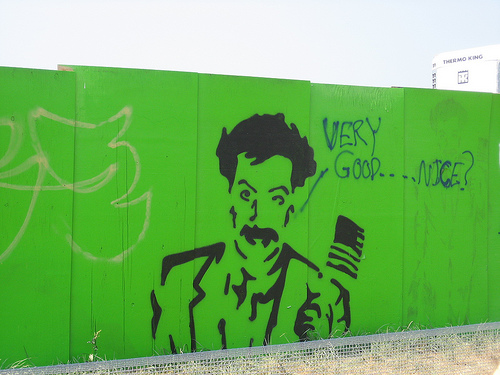

!SLIDE larger

	Case Study 1:  
	  healthcare
	
!SLIDE larger

[ VC-funded healthcare startup]

!SLIDE  larger

[ team of contracted and hired developers ]
	
!SLIDE  smallest

    +----------------------+-------+-------+---------+---------+-----+-------+
    | Name                 | Lines |   LOC | Classes | Methods | M/C | LOC/M |
    +----------------------+-------+-------+---------+---------+-----+-------+
    | Controllers          |  2548 |  1859 |      31 |     191 |   6 |     7 |
    | Helpers              |   933 |   730 |       0 |      64 |   0 |     9 |
    | Models               |  3150 |  1727 |      65 |     205 |   3 |     6 |
    | Libraries            |  6557 |  3894 |      58 |     324 |   5 |    10 |
    | Functional tests     |  2151 |  1705 |      50 |     209 |   4 |     6 |
    | Unit tests           |  1871 |  1461 |      50 |     187 |   3 |     5 |
    +----------------------+-------+-------+---------+---------+-----+-------+
    | Total                | 17210 | 11376 |     254 |    1180 |   4 |     7 |
    +----------------------+-------+-------+---------+---------+-----+-------+
      Code LOC: 8210     Test LOC: 3166     Code to Test Ratio: 1:0.4

    [ medium footprint ]

!SLIDE  smallest

    +----------------------+-------+-------+---------+---------+-----+-------+
    | Name                 | Lines |   LOC | Classes | Methods | M/C | LOC/M |
    +----------------------+-------+-------+---------+---------+-----+-------+
    | Controllers          |  2548 |  1859 |      31 |     191 |   6 |     7 |
    | Helpers              |   933 |   730 |       0 |      64 |   0 |     9 |
    | Models               |  3150 |  1727 |      65 |     205 |   3 |     6 |
    | Libraries            |  6557 |  3894 |      58 |     324 |   5 |    10 |
    | Functional tests     |  2151 |  1705 |      50 |     209 |   4 |     6 |
    | Unit tests           |  1871 |  1461 |      50 |     187 |   3 |     5 |
    +----------------------+-------+-------+---------+---------+-----+-------+
    | Total                | 17210 | 11376 |     254 |    1180 |   4 |     7 |
    +----------------------+-------+-------+---------+---------+-----+-------+
      Code LOC: 8210     Test LOC: 3166     Code to Test Ratio: 1:0.4

    [ small, worthless test suite ]

!SLIDE  larger

[ lots of emphasis on view work ]

!SLIDE larger

[ slow AJAX interactions ]

!SLIDE larger

[ main interface:  a 3-step "wizard" ]

!SLIDE smaller

 

                                        	[ sleeve of wizard ]

 photo: <a href="http://www.flickr.com/photos/amoir/300675038/">amoir</a>

!SLIDE

TODO:  claim/payment/eob data model

!SLIDE

TODO:  acts_as_Ass

