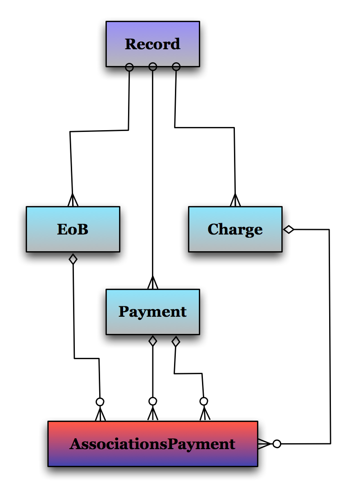
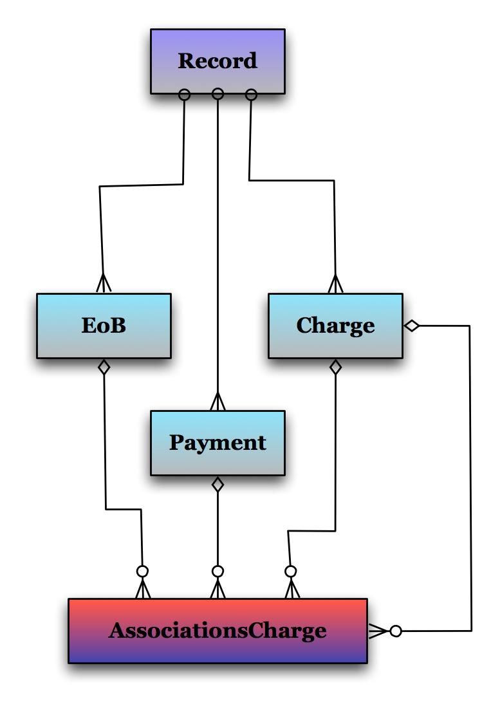

!SLIDE

    Core data model

!SLIDE larger

[ the primary purpose of the application ]

!SLIDE larger

[ tracking medical payments, bills, eob's, etc. ... ]

!SLIDE larger

[ mis-modelled. ]

!SLIDE code smallest

    @@@ruby
    
    class Payment < ActiveRecord::Base
      acts_as_taggable
      acts_as_associatable
      attr_human_name 'person_id' => 'Family Member'
      attr_human_name 'health_issue' => 'Reason for Visit'
      belongs_to :pre_tax_account
      belongs_to :deductible_expense
      belongs_to :user
      has_many_polymorphs :associations, :from => [ :payments, :charges, 
         :explanation_of_benefits ], :as => :associatable, 
         :through => :associations_payments
      has_many    :notes, :as => :association, :order => 'filed_on'
      belongs_to  :health_issue_accepted_term, :foreign_key => 'health_issue_term_id', :class_name => 'AcceptedHealthTerm'
      before_save   :set_defaults
      validates_presence_of :paid_on, :if => :step_three?
      validates_date :service_date, :if => :service_date?
      validates_date_time :created_on, :if => :created_on?
      validates_date :paid_on, :if => :paid_on?
    
      def self.type
        'payment'
      end
    
      def type
        self.class.type
      end
    
      def occurred_on
        paid_on
      end
    
      def self.controller_name
        'payments'
      end

      # ...

!SLIDE code smallest

    @@@ruby

    class Payment < ActiveRecord::Base
      
      acts_as_associatable
      
      
      
      
      
      has_many_polymorphs :associations, :from => [ :payments, :charges, 
         :explanation_of_benefits ], :as => :associatable, 
         :through => :associations_payments
      has_many    :notes, :as => :association, :order => 'filed_on'
      
      
      validates_presence_of :paid_on, :if => :step_three?
      validates_date :service_date, :if => :service_date?
      validates_date_time :created_on, :if => :created_on?
      validates_date :paid_on, :if => :paid_on?

      def self.type
        'payment'
      end

      
      
      

      def occurred_on
        paid_on
      end

      def self.controller_name
        'payments'
      end

      # ...    
    
!SLIDE code smallest

    @@@ruby
    class Charge < ActiveRecord::Base
      acts_as_taggable
      acts_as_associatable
      attr_human_name 'person_id' => 'Family Member'
      attr_human_name 'health_issue' => 'Reason for Visit'
      attr_human_name 'billed_on' => 'Billing Date'
      FILED_BY_OPTIONS = ['Provider', 'Me', 'Not applicable']
      belongs_to :actual_servicetype, :class_name=>"Servicetype", :foreign_key=>"servicetype_id"
      belongs_to :user
      has_many_polymorphs :associations, :from => [ :payments, :charges, 
         :explanation_of_benefits ], :as => :associatable, 
         :through => :associations_charges
      has_many    :notes, :as => :association, :order => 'filed_on'
      validates_presence_of :billed_on, :if => :step_three?
      validates_presence_of :amount_in_cents, :if => :step_three?
      validates_date :service_date, :if => :service_date?
      validates_date :billed_on, :if => :billed_on?
      validates_presence_of :servicetype, :if => :step_three?
      validates_associated :actual_servicetype, :if => :step_three?
    
      def self.type
        'bill'
      end
    
      def type
        self.class.type
      end
    
      def occurred_on
        billed_on
      end
    
      def self.controller_name
        'bills'
      end
    
      # ...

!SLIDE code smallest

    @@@ruby
    class Charge < ActiveRecord::Base
      
      acts_as_associatable
      
      
      
      
      
      
      has_many_polymorphs :associations, :from => [ :payments, :charges, 
         :explanation_of_benefits ], :as => :associatable, 
         :through => :associations_charges
      has_many    :notes, :as => :association, :order => 'filed_on'
      validates_presence_of :billed_on, :if => :step_three?
      validates_presence_of :amount_in_cents, :if => :step_three?
      
      
      validates_presence_of :servicetype, :if => :step_three?
      validates_associated :actual_servicetype, :if => :step_three?

      def self.type
        'bill'
      end

      
      
      

      def occurred_on
        billed_on
      end

      def self.controller_name
        'bills'
      end

      # ...    
    
!SLIDE code smallest

    @@@ruby
    class ExplanationOfBenefit < ActiveRecord::Base
      acts_as_taggable
      acts_as_associatable
      attr_human_name 'person_id' => 'Family Member'
      attr_human_name 'health_issue' => 'Reason for Visit'
      belongs_to :insurance  
      belongs_to :user
      has_many_polymorphs :associations, :from => [ :payments, :charges, 
         :explanation_of_benefits ], :as => :associatable, 
         :through => :associations_eobs
      has_many    :notes, :as => :association, :order => 'filed_on'
      validates_presence_of :date, :if => :step_three?
      validates_date :service_date, :if => :service_date?
      validates_date :date, :if => :date?
      validates_date :paid_on, :if => :paid_on?
         
      def self.type
        'EOB'
      end
    
      def type
        self.class.type
      end
    
      def occurred_on
        date
      end
    
      def self.controller_name
        'explanation_of_benefits'
      end

      # ...    
    
!SLIDE code smallest

    @@@ruby
    class ExplanationOfBenefit < ActiveRecord::Base
      
      acts_as_associatable
      
      
      
      
      has_many_polymorphs :associations, :from => [ :payments, :charges, 
         :explanation_of_benefits ], :as => :associatable, 
         :through => :associations_eobs
      has_many    :notes, :as => :association, :order => 'filed_on'
      validates_presence_of :date, :if => :step_three?
      validates_date :service_date, :if => :service_date?
      validates_date :date, :if => :date?
      validates_date :paid_on, :if => :paid_on?

      def self.type
        'EOB'
      end

      
      
      

      def occurred_on
        date
      end

      def self.controller_name
        'explanation_of_benefits'
      end

      # ...    
    

!SLIDE

    Right next to each other...

!SLIDE code smallest

    @@@ruby
    class Charge < ActiveRecord::Base
      
      acts_as_associatable
      
      
      
      
      
      
      has_many_polymorphs :associations, :from => [ :payments, :charges, 
         :explanation_of_benefits ], :as => :associatable, 
         :through => :associations_charges
      has_many    :notes, :as => :association, :order => 'filed_on'
      validates_presence_of :billed_on, :if => :step_three?
      validates_presence_of :amount_in_cents, :if => :step_three?
      
      
      validates_presence_of :servicetype, :if => :step_three?
      validates_associated :actual_servicetype, :if => :step_three?

      def self.type
        'bill'
      end

      
      
      

      def occurred_on
        billed_on
      end

      def self.controller_name
        'bills'
      end

!SLIDE code smallest

    @@@ruby

    class Payment < ActiveRecord::Base

      acts_as_associatable

      has_many_polymorphs :associations, :from => [ :payments, :charges, 
         :explanation_of_benefits ], :as => :associatable, 
         :through => :associations_payments
      has_many    :notes, :as => :association, :order => 'filed_on'

      validates_presence_of :paid_on, :if => :step_three?
      validates_date :service_date, :if => :service_date?
      validates_date_time :created_on, :if => :created_on?
      validates_date :paid_on, :if => :paid_on?

      def self.type
        'payment'
      end

      def occurred_on
        paid_on
      end

      def self.controller_name
        'payments'
      end

!SLIDE code smallest

    @@@ruby
    class ExplanationOfBenefit < ActiveRecord::Base

      acts_as_associatable

      has_many_polymorphs :associations, :from => [ :payments, :charges, 
         :explanation_of_benefits ], :as => :associatable, 
         :through => :associations_eobs
      has_many    :notes, :as => :association, :order => 'filed_on'
      validates_presence_of :date, :if => :step_three?
      validates_date :service_date, :if => :service_date?
      validates_date :date, :if => :date?
      validates_date :paid_on, :if => :paid_on?

      def self.type
        'EOB'
      end

      def occurred_on
        date
      end

      def self.controller_name
        'explanation_of_benefits'
      end

!SLIDE smaller

    Even blindly looking at code these models are 
    clearly related.

    Conceptually they're tightly related as well.

    They should be in the same class hierarchy.

    But changing the core of the application is 
    hard to justify.

!SLIDE smaller

    Turns out there is a lot of infrastructure
    here related to making sure these various
    "ledger entries" are grouped together if
    they are part of the same medical visit.

    But the conceptual scoping to clinical visits
    is confused with a trivial concern about taxable
    mileage(!) and burying arbitrary reporting into
    a "Record" (a meaningless concept name).

!SLIDE code smallest

    @@@ruby
    class Record < ActiveRecord::Base
      # ...
      has_many    :charges, :order => 'billed_on', 
                    :after_add => :update_amount_billed, :after_remove => :update_amount_billed
      has_many    :explanations_of_benefits, :class_name => 'ExplanationOfBenefit', :order => 'date',
                    :after_add => :update_insurance_summaries, :after_remove => :update_insurance_summaries
      has_many    :notes, :as => :association, :order => 'filed_on'
      has_many    :payments, :order => 'paid_on',
                    :after_add => :update_amount_paid,   :after_remove => :update_amount_paid
      # ...      
      def self.controller_name
        'records'
      end
    
      def controller_name
        self.class.controller_name
      end
      
      def note_summary
        "TODO / FIXME"
      end

      # ... continued ...

!SLIDE code smallest
    @@@ruby
    def self.build_with( source )
      # ...
      collected = self.collect_associations( { source.uniq_id => source } )
      record = Record.new
      record.account_id = source.account_id
      record.save_with_validation false
      records = []

      collected.each { |key,c|
        records << c.record_id if c.record_id
        c.record_id = record.id
        c.save_with_validation false
      }

      records.uniq!
      record.mileage = 0
      records.each do |record_id|
        record.mileage += Record.find( record_id ).mileage rescue 0
        ( Record.destroy( record_id ) rescue nil ) unless record_id == record.id
      end

      record.update_build
      record
    end
    # ...

    # Returns an array with all associated Charges, Payments, and Explanations of Benefits
    def associations
      associations = (self.charges.to_a + self.payments.to_a + self.explanations_of_benefits.to_a)
      associations.sort do |one, other| 
        if one.occurred_on && other.occurred_on
          one.occurred_on <=> other.occurred_on
        else
          one.id <=> other.id
        end
      end
    end

!SLIDE code smallest
    @@@ruby
    def update_build
      collected = {}
      ( Payment.find( :all, :conditions => [ 'record_id = ?', self.id ], :include => [:record] ) + Charge.find( :all, :conditions => [ 'record_id = ?', self.id ], :include => [:record] ) + ExplanationOfBenefit.find( :all, :conditions => [ 'record_id = ?', self.id ], :include => [:record] ) ).each do |a|
        collected.merge!( { a.uniq_id => a } )
      end
      collected = self.class.collect_associations( collected )

      self.payments = []
      self.charges = []
      self.explanations_of_benefits = []
      records = []

      collected.each { |key,c|
        records << c.record_id if c.record_id
        c.record_id = self.id
        self.payments << c if c.kind_of?( Payment )
        self.explanations_of_benefits << c if c.kind_of?( ExplanationOfBenefit )
        self.charges << c if c.kind_of?( Charge )
        c.save_with_validation false
      }

      records.uniq!
      self.mileage = 0
      records.each do |record_id|
        self.mileage += Record.find( record_id ).mileage rescue 0
        ( Record.destroy( record_id ) rescue nil ) unless record_id == self.id
      end

      self.save_with_validation false

      self.update_summaries
      self.save_with_validation false
    end

!SLIDE

    The Record is stuck managing
    building and tearing down associations
    between different financial entries
    because the linkages between them
    suffer from lack of OO design.

!SLIDE code smallest

    @@@ruby

    # == Schema Information
    # Schema version: 473
    #
    # Table name: associations_payments
    #
    #  id               :integer(11)   not null, primary key
    #  associatable_id  :integer(11)   
    #  association_id   :integer(11)   
    #  association_type :string(255)   
    #
    
    class AssociationsPayment < ActiveRecord::Base
      belongs_to :associatable, :class_name => 'Payment', :foreign_key => 'id'
      belongs_to :associations, :polymorphic => true
    end

    class Payment < ActiveRecord::Base
      # ...
      has_many_polymorphs :associations, :from => [ :payments, :charges, 
         :explanation_of_benefits ], :as => :associatable, 
         :through => :associations_payments
      # ...
    end

!SLIDE full-page

!SLIDE code smallest

    @@@ruby

    # == Schema Information
    # Schema version: 473
    #
    # Table name: associations_charges
    #
    #  id               :integer(11)   not null, primary key
    #  associatable_id  :integer(11)   
    #  association_id   :integer(11)   
    #  association_type :string(255)   
    #
    
    class AssociationsCharge < ActiveRecord::Base
      belongs_to :associatable, :class_name => 'Charge', :foreign_key => 'id'
      belongs_to :associations, :polymorphic => true
    end

    class Charge < ActiveRecord::Base
      # ...
      has_many_polymorphs :associations, :from => [ :payments, :charges, 
         :explanation_of_benefits ], :as => :associatable, 
         :through => :associations_charges
      # ...
    end

!SLIDE full-page

!SLIDE code smallest

    @@@ ruby 
    
    # == Schema Information
    # Schema version: 473
    #
    # Table name: associations_eobs
    #
    #  id               :integer(11)   not null, primary key
    #  associatable_id  :integer(11)   
    #  association_id   :integer(11)   
    #  association_type :string(255)   
    #
    
    class AssociationsEob < ActiveRecord::Base
      belongs_to :associatable, :class_name => 'ExplanationOfBenefit', :foreign_key => 'id'
      belongs_to :associations, :polymorphic => true
    end

    class ExplanationOfBenefit < ActiveRecord::Base
      # ...
      has_many_polymorphs :associations, :from => [ :payments, :charges, 
         :explanation_of_benefits ], :as => :associatable, 
         :through => :associations_eobs
      # ...
    end

!SLIDE full-page

!SLIDE

    Putting this all together, 
    the core of the application
    is a *mess*

!SLIDE full-page

