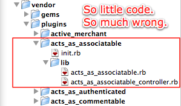

!SLIDE

    Acts as Ass

!SLIDE code smallest

    @@@ruby

    class Payment < ActiveRecord::Base
      # ...
      acts_as_associatable
      # ...
      has_many_polymorphs :associations, :from => [ :payments, :charges, 
         :explanation_of_benefits ], :as => :associatable, 
         :through => :associations_payments
      # ...
      has_many    :notes, :as => :association, :order => 'filed_on'
      # ...
    end

!SLIDE code smallest

    @@@ruby

    class Charge < ActiveRecord::Base
      # ...
      acts_as_associatable
      # ...
      has_many_polymorphs :associations, :from => [ :payments, :charges, 
         :explanation_of_benefits ], :as => :associatable, 
         :through => :associations_charges
      # ...
      has_many    :notes, :as => :association, :order => 'filed_on'
      # ...
    end

!SLIDE code smallest

    @@@ruby

    class ExplanationOfBenefit < ActiveRecord::Base
      # ...
      acts_as_associatable
      # ...
      has_many_polymorphs :associations, :from => [ :payments, :charges, 
         :explanation_of_benefits ], :as => :associatable, 
         :through => :associations_eobs
	    # ...
      has_many    :notes, :as => :association, :order => 'filed_on'
      # ...
    end

!SLIDE larger

[ looking for acts_as_ass elsewhere, it turned up in CONTROLLERS(!) ]

!SLIDE code smallest

    @@@ruby

    class BillsController < ApplicationController
    	# ...

      acts_as_associatable :model => Charge, :param => :charge

      # ...
    
    
      def create
        @charge = Charge.new(params[:charge])

        # ... 

        @charge.step = 3
        begin
          @charge.save!
          if params[:association]
            params[:association].each do |p|
              if p[:associate] == 'on'
                case p[:type]
                  when 'bill'
                    assoc_class = Charge
                  when 'payment'
                    assoc_class = Payment
                  when 'EOB'
                    assoc_class = ExplanationOfBenefit
                end
                @charge.associate(assoc_class.find(p[:id], :conditions => [ 'account_id = ?', current_user.account.id ]))
              end
            end
          end

				# ... it only gets worse

!SLIDE full-page

    
    