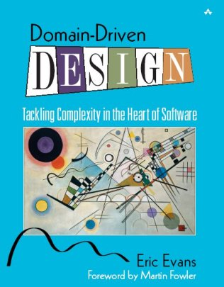

!SLIDE

    Acts as Ass

!SLIDE code smallest

    @@@ruby

    class Payment < ActiveRecord::Base
      # ...
      acts_as_associatable
      # ...
      has_many_polymorphs :associations, :from => [ :payments, :charges, 
         :explanation_of_benefits ], :as => :associatable, 
         :through => :associations_payments
      # ...
      has_many    :notes, :as => :association, :order => 'filed_on'
      # ...
    end

!SLIDE code smallest

    @@@ruby

    class Charge < ActiveRecord::Base
      # ...
      acts_as_associatable
      # ...
      has_many_polymorphs :associations, :from => [ :payments, :charges, 
         :explanation_of_benefits ], :as => :associatable, 
         :through => :associations_charges
      # ...
      has_many    :notes, :as => :association, :order => 'filed_on'
      # ...
    end

!SLIDE code smallest

    @@@ruby

    class ExplanationOfBenefit < ActiveRecord::Base
      # ...
      acts_as_associatable
      # ...
      has_many_polymorphs :associations, :from => [ :payments, :charges, 
         :explanation_of_benefits ], :as => :associatable, 
         :through => :associations_eobs
	    # ...
      has_many    :notes, :as => :association, :order => 'filed_on'
      # ...
    end

!SLIDE

    [ TODO:  describe acts_as_ass model functionality ]

!SLIDE

    looking for acts_as_ass elsewhere
    it turned up in CONTROLLERS(!)

!SLIDE code smallest

    @@@ruby
    
    class PaymentsController < ApplicationController
      # ...
    
      acts_as_associatable :model => Payment, :param => :payment
    
      # ...
    
      def create
        @payment = Payment.new( params[:payment] )
    
        # ...
    
        @payment.step = 3
        begin
          @payment.save!
          if params[:association]
            params[:association].each do |p|
              if p[:associate] == 'on'
                case p[:type]
                  when 'bill'
                    assoc_class = Charge
                  when 'payment'
                    assoc_class = Payment
                  when 'EOB'
                    assoc_class = ExplanationOfBenefit
                end
                @payment.associate( assoc_class.find( p[:id], :conditions => [ 'account_id = ?', current_user.account_id ] ) )
              end
            end
          end
    
        # ... it only gets worse
			
!SLIDE code smallest

    @@@ruby

    class ExplanationOfBenefitsController < ApplicationController
      # ...

      acts_as_associatable :model => ExplanationOfBenefit, :param => :explanation_of_benefit

      # ...    
    
      def create
        @eob = ExplanationOfBenefit.new( params[:explanation_of_benefit] )

        # ...    
    
        @eob.step = 3
        begin
          @eob.save!
          if params[:association]
            params[:association].each do |p|
              if p[:associate] == 'on'
                case p[:type]
                  when 'bill'
                    assoc_class = Charge
                  when 'payment'
                    assoc_class = Payment
                  when 'EOB'
                    assoc_class = ExplanationOfBenefit
                end
                @eob.associate(assoc_class.find(p[:id], :conditions => [ 'user_id = ?', current_user.id ]))
              end
            end
          end

        # ... it only gets worse

!SLIDE code smallest

    @@@ruby

    class BillsController < ApplicationController
    	# ...

      acts_as_associatable :model => Charge, :param => :charge

      # ...
    
      def create
        @charge = Charge.new(params[:charge])

        # ... 

        @charge.step = 3
        begin
          @charge.save!
          if params[:association]
            params[:association].each do |p|
              if p[:associate] == 'on'
                case p[:type]
                  when 'bill'
                    assoc_class = Charge
                  when 'payment'
                    assoc_class = Payment
                  when 'EOB'
                    assoc_class = ExplanationOfBenefit
                end
                @charge.associate(assoc_class.find(p[:id], :conditions => [ 'account_id = ?', current_user.account.id ]))
              end
            end
          end

        # ... it only gets worse

!SLIDE

    Also, it a "Bill" or a "Charge"?

!SLIDE code smallest

    @@@ruby
    
    class BillsController < ApplicationController
      #   ^^^^^
    
      acts_as_associatable :model => Charge, :param => :charge
    
      #                              ^^^^^^
    
    
      def create
        @charge = Charge.new(params[:charge])
    
        #         ^^^^^^

!SLIDE

               If you aren't cringing, 
               please go now and 
               shower Eric Evans
               with your $$$ for a copy 
               of Domain Driven Design.

 
 
 

	

!SLIDE full-page

!SLIDE code smallest
    @@@ruby
    module ActsAsAssociatable
      module ControllerActs
        # ...
            def acts_as_associatable( options = {} )
              class_eval <<-END
                def new
                  @#{options[:param]} = #{options[:model]}.new
                  @#{options[:param]}.step = 1
                end
    
                def step_two
                  @#{options[:param]} = #{options[:model]}.new( params[:#{options[:param]}] )
                  @#{options[:param]}.health_issue_term_id = ( AcceptedHealthTerm.find_using_health_term( :text => params[:#{options[:param]}][:health_term], :usage => "DIAG" ).id rescue false ) #unless params[:#{options[:param]}][:health_issue_term_id] && !params[:#{options[:param]}][:health_issue_term_id].empty?
                  @#{options[:param]}.step = 1
    
                  if @#{options[:param]}.valid?
                    @#{options[:param]}.step = 2
                    @#{options[:param]}.account_id = current_user.account_id
                    @possible_associations = @#{options[:param]}.possible_associations
                    render :partial => 'possible_associations', :layout => false
                  else
                    render :status => 444, :text => '<ul class="errors"><li>'+@#{options[:param]}.errors.full_messages.join('</li><li>')+'</li></ul>'
                  end
                end
    
                def step_three
                  @#{options[:param]} = #{options[:model]}.new( params[:#{options[:param]}] )
                  @#{options[:param]}.health_issue_term_id = ( AcceptedHealthTerm.find_using_health_term( :text => params[:#{options[:param]}][:health_term], :usage => "DIAG" ).id rescue false ) #unless params[:#{options[:param]}][:health_issue_term_id] && !params[:#{options[:param]}][:health_issue_term_id].empty?
                  @associations = []
                  ( params[:association] || [] ).each { |a|
                    @associations << a if a[:associate] == 'on'
                  }
    
                  if @#{options[:param]}.valid?
                    @#{options[:param]}.step = 3
                    render :partial => 'step_three', :layout => false
                  else
                    render :status => 444, :text => '<ul class="errors"><li>'+@#{options[:param]}.errors.full_messages.join('</li><li>')+'</li></ul>'
                  end             
        # ...

!SLIDE code smallest
    @@@ruby
    # ... continued ...

       def edit
         @#{options[:param]} = #{options[:model]}.find params[:id], :conditions => 
            [ 'account_id = ?', current_user.account_id ]
         @associations = @#{options[:param]}.associations
         @possible_associations = @#{options[:param]}.possible_associations
       end

       def chain
         render( :status => 404, :text => 'Invalid Association' ) && return unless 
           [ 'Payment', 'ExplanationOfBenefit', 'Charge' ].include?( params[:type] )
         @#{options[:param]}_chained_from = Kernel.const_get(params[:type]).find 
           params[:id], :conditions => [ 'account_id = ?', current_user.account_id ]
         @associations = [ @#{options[:param]}_chained_from ]
         @possible_associations = @#{options[:param]}_chained_from.possible_associations
         @#{options[:param]} = #{options[:model]}.new
         @#{options[:param]}.dup_step_one_from( @#{options[:param]}_chained_from )
         @#{options[:param]}.step = 2
       end
     END
    
!SLIDE

    So this is just a controller Module 
    instead of using inheritance.

    Aversion to inheritance is causing
    much pain.

    Way to go, "guru".

!SLIDE code smallest
    @@@ruby
    def acts_as_associatable( options = {} )
      class_eval <<-END
        def new
          # ...
        end
    
        def step_two
          # ...
        end
    
        def step_three
          # ...
        end           
    
        def edit
          # ...
        end
    
        def chain
          # ...
        end
      END
    end

!SLIDE larger

[ to avoid using inheritance a model Module is created ] 

!SLIDE larger

[ but the resources on the UI need the same "wizard" ]

!SLIDE larger

[ so, use a controller Module ]

!SLIDE larger

[ and then, shove them both in a plug-in ]

!SLIDE larger

[ where they're invisible ]

!SLIDE larger

[ almost untestable ]

!SLIDE larger

[ and require environment resets to change! ]

