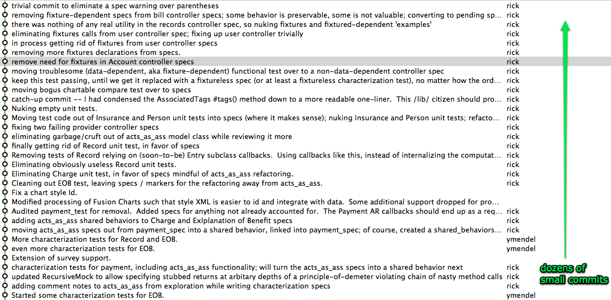

!SLIDE

    Characterizing

!SLIDE code smallest

    @@@diff
    
    Author: rick 
    
        added 'currently' rspec verb for writing characterization tests
    
    diff --git a/spec/spec_helper.rb b/spec/spec_helper.rb
    index 83b263c..ac44038 100644
    --- a/spec/spec_helper.rb
    +++ b/spec/spec_helper.rb
    
    +# define a spec helper for writing characterization tests -- make it easy to 
    +module Spec::DSL::BehaviourEval::ModuleMethods 
    +  def currently(name, &block)
    +    it("*** CURRENTLY *** #{name}", &block)
    +  end
    +end
    +
    +# characterization test hook -- allows us to mark specs as "characterization tests" (i.e., simply supporting
    +# the existing functionality) ... TODO
    +
     Spec::Runner.configure do |config|
       config.use_transactional_fixtures = true
       config.use_instantiated_fixtures  = false

!SLIDE code smallest

    @@@ruby
    
    describe Payment do
      # ...    
      currently "has a bunch of acts_as_association behavior" do
        @payment.should respond_to(:associate)
      end
    
      currently "can have many assocations" do
        @payment.associations.should == []
      end
      # ...
      currently "reports that it has a type of 'payment'" do
        @payment.type.should == 'payment'
      end
      # ...    
      currently "has an occurred_on value which is the same as its paid_on value" do
        @payment.paid_on = '2007-12-12'
        @payment.occurred_on.should == @payment.paid_on
      end
    
      currently "has a controller name of 'payments'" do
        @payment.controller_name.should == 'payments'
      end
      # ...    
      it "should have characterization tests for behavior from acts_as_associatable"
    end
    
    describe Payment, "as a class" do
      # ...     
      currently "reports that it has a type of 'payment'" do
        Payment.type.should == 'payment'
      end
    
      currently "has a controller name of 'payments'" do
        Payment.controller_name.should == 'payments'
      end
    end

!SLIDE

    We alternate between characterizing
    and reasoning about the code,
    recording our findings as comments

!SLIDE code smallest

    @@@diff
    --- a/vendor/plugins/acts_as_associatable/lib/acts_as_associatable.rb
    +++ b/vendor/plugins/acts_as_associatable/lib/acts_as_associatable.rb
     
    +        # NOTE:  this is called only from the 3-step controller(s) and *RECURSIVELY*(!!) by itself.  wtf.
             def associate( association, options = {} )
     
    +        # only called from the 3-step controllers
             def unassociate( association )
     
    +        # NOTE:  called only from within the acts_as_ass controller 
             def dup_step_one_from( assoc )
     
    +        # NOTE: used, for some reason to identify possible duplicate associations
             def uniq_id
     
    +        # NOTE: simple delegate to this class
             def possible_associations
     
    +        # NOTE:  used only by application helper suggested_mileage_for (which should be in a model, fwiw)
             def associated_providers
    +          # BUG:  the providers list can be empty
     
    +        # NOTE: this simply sets a default mileage, by polling the associated record; this should just be a delegate, ftw.
             def mileage
     
    +        # NOTE: why bother?  should be a delegate.  It doesn't appear that this is called from anywhere.  Should double-check.
             def mileage=( new_mileage )
     
    +        # NOTE: should probably associate a mileage rate to this model, though a delegate would not be too bad; the guessing bit has to go.  only called in show views for these models.
             def mileage_rate
    +            # NOTE:  this probably becomes a simple method on the new Entry base class to search for related entries.
    +            # NOTE:  this is only called by the "step two" controller nonsense.

!SLIDE code smallest
    @@@diff
    Author: rick
        characterization tests for payment, including acts_as_ass 
        functionality; will turn the acts_as_ass specs into a shared behavior next
    
    --- a/spec/models/payment_spec.rb
    +++ b/spec/models/payment_spec.rb
    
    describe Payment do
    +  
    +  currently "has a paid on date" do
    +    @payment.paid_on.should be_nil
    +  end
       
    +describe Payment, "including ActsAsAssinine" do
    +  currently "has a step attribute" do
    +    @payment.should respond_to(:step)
    +    @payment.should respond_to(:step=)
    +  end
    +  
    +  currently "can have an associated record" do
    +    @payment.record.should be_nil
    +  end
       # ...
    +  describe "in step one" do
    +    before :each do
    +      @payment.stubs(:step_one?).returns(true)
    +    end
    +    
    +    currently "is invalid without a person_id" do
    +      @payment.stubs(:step_one?).returns(true)
    +      @payment.should_not be_valid
    +      @payment.should have_at_least(1).errors_on(:person_id)
    +    end
       # ... 
    +  describe "as a Class" do
    +    currently "has a possible associations method" do
    +      Payment.should respond_to(:possible_associations)
    +    end
    +    
    +    currently "fails when possible associations is passed an empty source" do
    +      lambda { Payment.possible_associations(nil) }.should raise_error
    +    end
    +    
    +    currently "does lots of instance computation when possible associations are looked up" do
    +      lambda { Payment.possible_associations(RecursiveMock.new) }.should_not raise_error
    +    end
    +  end
     end

!SLIDE

    Shared behaviors let us quickly spec the 
    common parts of Payments, Charges, and EOBs

!SLIDE code smallest

    @@@diff
    --- a/spec/models/payment_spec.rb
    +++ b/spec/models/payment_spec.rb
    +require File.dirname(__FILE__) + '/../shared_behaviors/acts_as_ass_model_behavior'
     
     describe Payment do
       before(:each) do
         @payment = Payment.new
       end
       
    +  describe "(due to including acts_as_ass)" do
    +    before(:each) do
    +      @class = Payment
    +    end
    +
    +    it_should_behave_like "models that include acts_as_ass"
    +  end
    +

!SLIDE full-page

                      :joins => 'JOIN accepted_health_terms ON (payments.health_issue_term_id = accepted_health_terms.id ) JOIN health_terms ON (accepted_health_terms.health_term_id = health_terms.id )',    