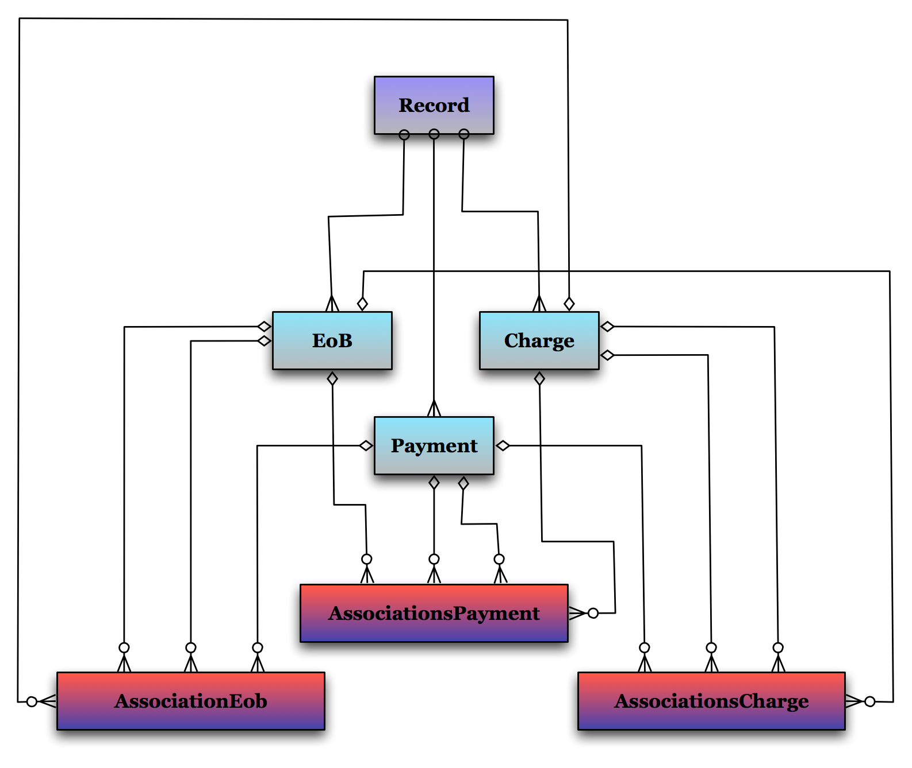

!SLIDE

    Impact?

!SLIDE larger

[ performance increased dramatically ]

!SLIDE larger

[ as in *minutes* off various critical page-loads ]

!SLIDE larger

[ down to 100-300ms response times ]

!SLIDE larger

[ which ain't great ]

!SLIDE larger

[ but there's only so shiny a turd will get ]

!SLIDE larger

[ code progress on all fronts accelerated ]

!SLIDE larger

[ test coverage continued to increase ]

!SLIDE larger

[ test runtime continued to drop ]

!SLIDE larger 

[ were able to forget the prior problems ]

!SLIDE larger

[ were able to move on to less-critical messes ]

!SLIDE

    A developer on the team:

      "What happened to all that code?"

!SLIDE

    A developer on the team:

      "What happened to all that code?"

    Us:

      "It's no longer needed."

!SLIDE

    Improper domain modelling multiplies code
    footprint, development costs, and slows down
    applications and tests.

!SLIDE full-page

!SLIDE full-page

