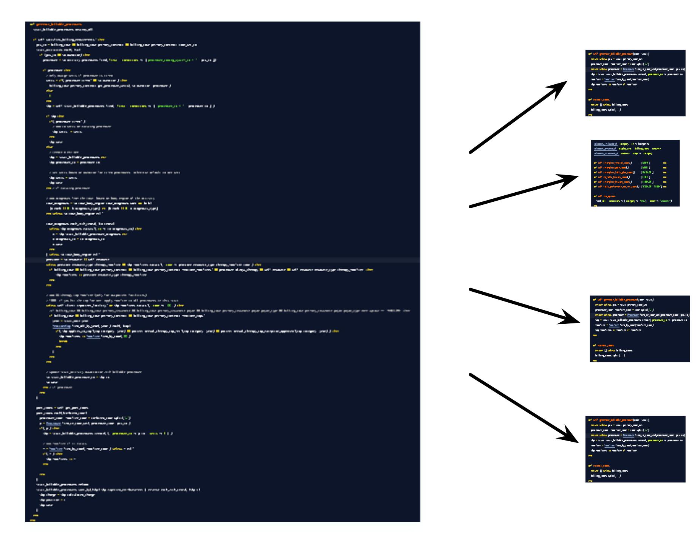
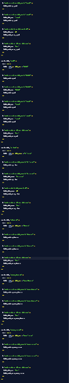
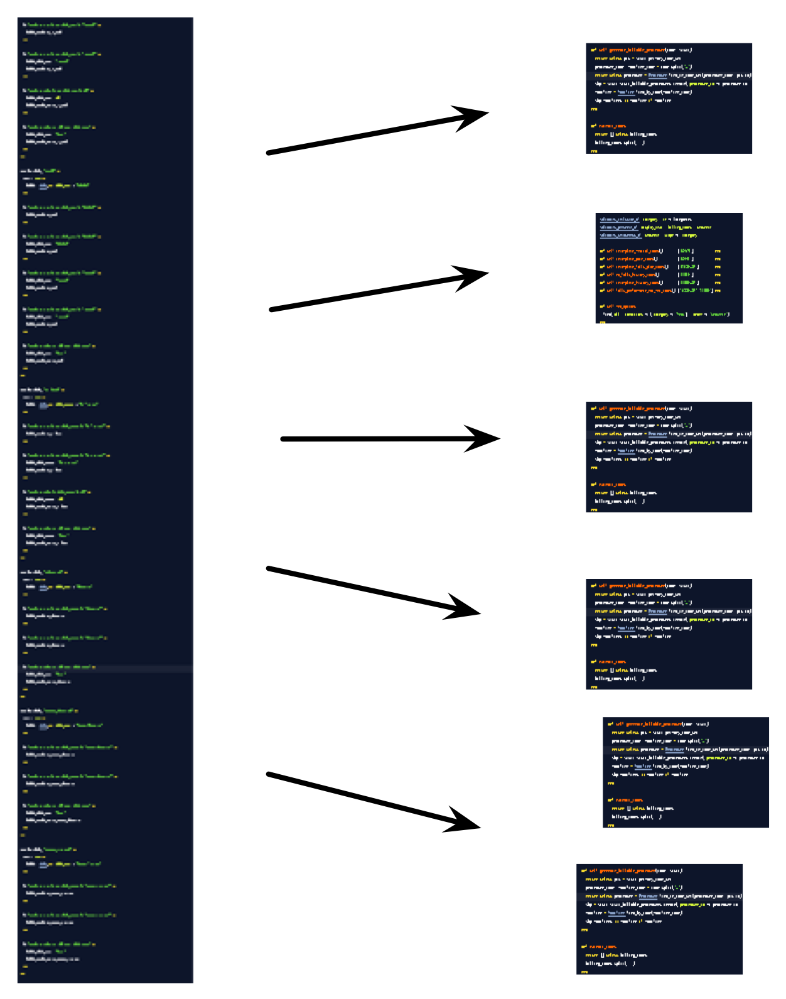

!SLIDE

    Case Study:

      healthcare 2

!SLIDE larger

[ another clinical system ]

!SLIDE larger

[ practice management *and* clinical record ] 

!SLIDE larger

[ large-scale production app, with hints of "shanty town" ] 

!SLIDE larger

[ billing / claims system needs serious work ] 

!SLIDE larger

[ so much so that they are bypassing it and using a legacy system ] 

!SLIDE larger

[ so the bottleneck of interest is an isolated mud-field ] 

!SLIDE larger

[ which means we can approach it like a mud-field ] 

!SLIDE larger

[ site visit to get into the process & team ]

!SLIDE larger

[ ... and intensively review the domain model ] 

!SLIDE larger

[ one monolithic 100+ line model method ]

!SLIDE larger

[ generates all downstream billing/claims information ] 

!SLIDE larger 

[ zero tests on this code ]

!SLIDE larger

[ spike: used textual refactoring to "refactor" ]

!SLIDE larger

[ the spike was non-running, non-tested code ] 

!SLIDE full-page

!SLIDE larger

[ reviewed the spike refactoring with technical / business expert ] 

!SLIDE larger

[ converted the spike into specs ]

!SLIDE full-page

!SLIDE larger

[ developed TDD from the spike-informd specs ]

!SLIDE full-page

!SLIDE larger

[ impact: ongoing ] 
